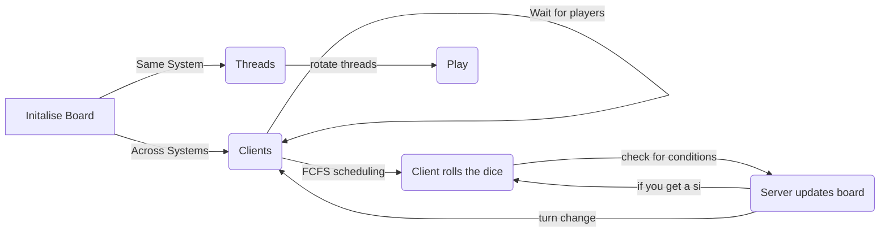

# DatabaseEngine

# RTOS Project: Ludo Game
-__Group__: 
* Atharva Deshpande (IMT2015011)
* Kedar Kulkarni (IMT2015021)
* Juhi Singh (IMT2015019)

## Problem Statement
A realtime multiplayer ludo game allowing gaming on the same system and/or across systems. 
The game should have the following set of rules:
* Maximum 4 players  
* Each player has 4 pawns
* The player that manages to get all 4 pawns to the goal first, wins
* You require a 6 on the dice to start a pawn
* You are allowed to roll the die again if you get a 6
* You can move a pawn already on the board or start a new pawn, if you get a six
* The player gets to decide which pawn to move.
* The players can eliminate each others pawns
## Solution

* We implemented gaming on the same platform using  __multi-threading__ 
* We used __socket programming__ for gaming across multiple systems

## Implementation

* We implemented two separate versions of the game, one that is cross system and one that is one system.
* We use co-routines to create ludo when we are playing on the same system
* We use socket programming to communicate between the players and the main server, for the multi-system version.
* We use to and fro messages between client and server to decide the pawn positions, based upon the decisions of the client

*  The the board is then displayed to the all the clients after every turn

4*4 matrix represents 4 pawns of 4 players,
where '-1' implies that the pawns are still at home
## Gaps in Implementation

* Lack of a GUI based application
* The two versions of the game (cross-system and same system) are not integrated in one unit.

## Challenges
* sprintf() and itoa() are not compatible with all systems, either of these were necessary to convert the positions of the arrays to string
* Trouble integrating threads with socket programming
* Displaying board to multiple clients
* Waiting for all four clients to arrive
* Encoding the board

## Source Code
[Project Link](https://github.com/Juhi-0711/RTOS/tree/master/PROJECT_LUDO)

